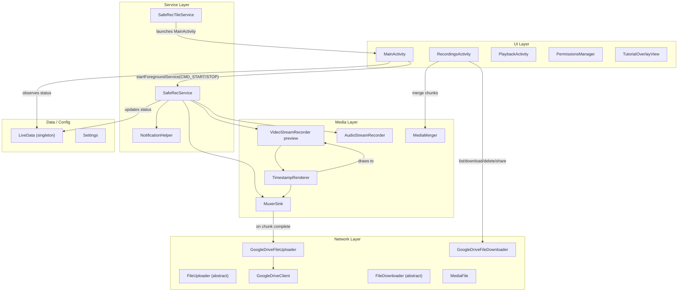
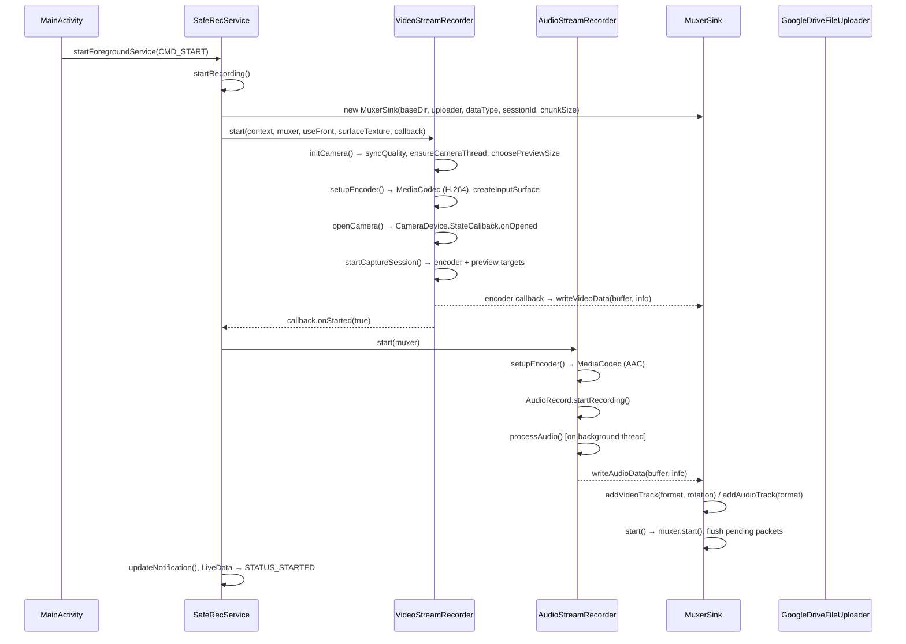
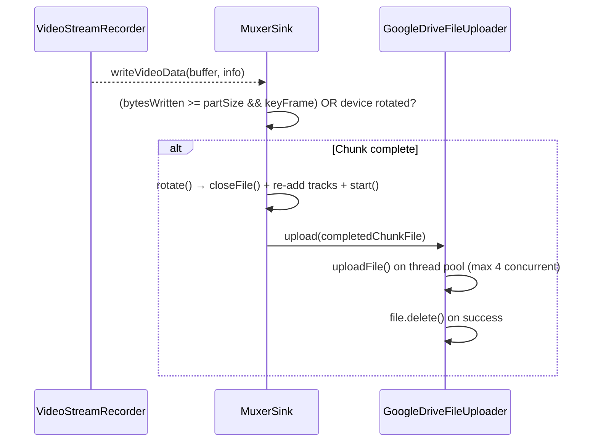
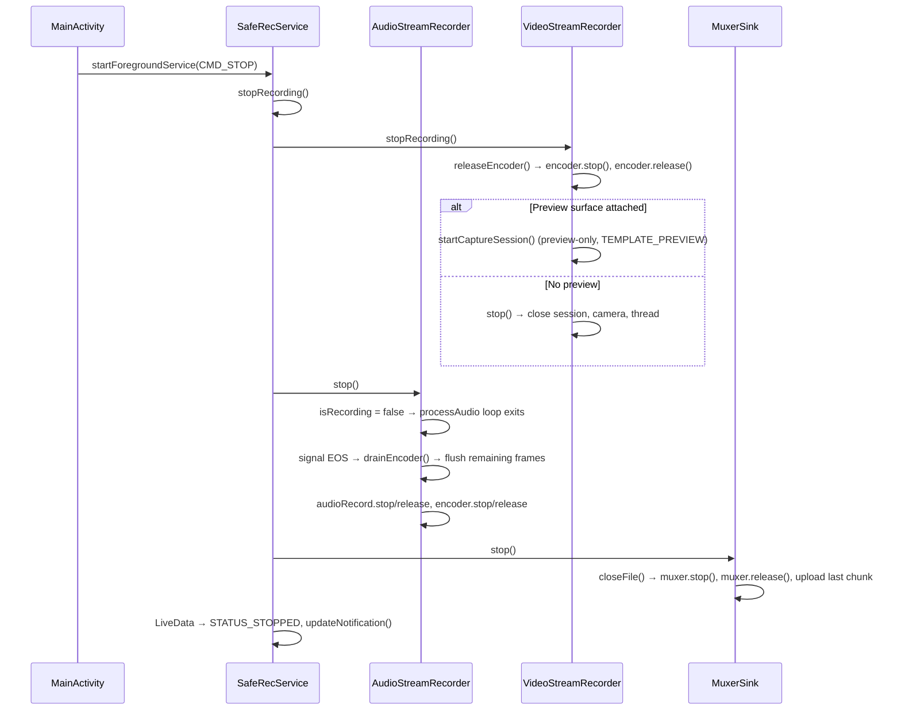

# SafeRec — Application Architecture

> **Package:** `net.ark3us.saferec`
> **Platform:** Android (Camera2 API, MediaCodec, MediaMuxer)
> **Purpose:** Background audio/video recording with chunked upload to Google Drive

---

## High-Level Architecture



---

## Package Structure

```
net.ark3us.saferec/
├── MainActivity.java          # Main UI, preview, start/stop, settings
├── RecordingsActivity.java    # Browse/download/merge/share recordings from Drive
├── RecordingsAdapter.java     # RecyclerView adapter for recordings list
├── PlaybackActivity.java      # Video playback (streaming from Drive)
├── PermissionsManager.java    # Runtime permissions + Google Drive OAuth
│
├── data/
│   └── LiveData.java          # Singleton observable for service status
│
├── media/
│   ├── VideoStreamRecorder.java  # Camera2 + MediaCodec video encoder (singleton)
│   ├── AudioStreamRecorder.java  # AudioRecord + MediaCodec AAC encoder
│   ├── MuxerSink.java            # MediaMuxer wrapper with chunking + upload
│   ├── MediaMerger.java          # Merges MP4 chunks into a single file
│   └── TimestampRenderer.java    # OpenGL pipeline for timestamp compositing
│
├── misc/
│   └── Settings.java          # SharedPreferences wrapper
│
├── net/
│   ├── FileUploader.java         # Abstract uploader with thread pool
│   ├── GoogleDriveFileUploader.java  # Drive upload implementation
│   ├── GoogleDriveClient.java    # Low-level Drive API wrapper
│   ├── FileDownloader.java       # Abstract downloader
│   ├── GoogleDriveFileDownloader.java  # Drive download implementation
│   └── MediaFile.java           # Chunk filename parser/generator
│
├── services/
│   ├── SafeRecService.java       # Foreground service orchestrating recording
│   ├── SafeRecTileService.java   # Quick Settings tile to start recording
│   └── NotificationHelper.java  # Notification channel + builder
│
└── ui/
    └── TutorialOverlayView.java  # First-run tutorial overlay
```

---

## Recording Lifecycle (Detail)

### 1. Start Recording



### 2. Chunking & Upload (during recording)



### 3. Stop Recording



### 4. Camera Switch Mid-Recording

When the user switches front↔back during recording, [SafeRecService](file:///home/ark3us/Filen/Dev/SafeRec/app/src/main/java/net/ark3us/saferec/services/SafeRecService.java#21-227) receives a new `CMD_START`:

1. [stopRecording()](file:///home/ark3us/Filen/Dev/SafeRec/app/src/main/java/net/ark3us/saferec/MainActivity.java#523-530) — tears down audio, video, and muxer (uploads final chunk)
2. [startRecording()](file:///home/ark3us/Filen/Dev/SafeRec/app/src/main/java/net/ark3us/saferec/services/SafeRecService.java#112-181) — creates a **new session/muxer**, re-opens camera with new ID
3. This is a full restart, not a hot swap — there's a brief gap in the recording

### 5. Preview Lifecycle (Independent of Recording)

| State | Action |
|-------|--------|
| **App opens (not recording)** | [startPreview()](file:///home/ark3us/Filen/Dev/SafeRec/app/src/main/java/net/ark3us/saferec/media/VideoStreamRecorder.java#121-140) → opens camera, preview-only session (`TEMPLATE_PREVIEW`) |
| **App opens (recording in progress)** | [attachPreview()](file:///home/ark3us/Filen/Dev/SafeRec/app/src/main/java/net/ark3us/saferec/media/VideoStreamRecorder.java#271-287) → rebuilds capture session with preview + encoder |
| **App goes to background (recording)** | [detachPreview()](file:///home/ark3us/Filen/Dev/SafeRec/app/src/main/java/net/ark3us/saferec/media/VideoStreamRecorder.java#256-270) → rebuilds capture session without preview |
| **App goes to background (not recording)** | [stop()](file:///home/ark3us/Filen/Dev/SafeRec/app/src/main/java/net/ark3us/saferec/media/VideoStreamRecorder.java#240-255) | closes camera entirely |
| **Recording stops (app visible)** | [stopRecording()](file:///home/ark3us/Filen/Dev/SafeRec/app/src/main/java/net/ark3us/saferec/MainActivity.java#523-530) | releases encoder, rebuilds preview-only session |

---

## Surveillance Mode

Implemented to burn a real-time timestamp into video recordings while simplifying the user interaction for static surveillance.

### Key Characteristics
- **Locked Orientation:** Enforces `ActivityInfo.SCREEN_ORIENTATION_LANDSCAPE`.
- **Forced Back Camera:** Camera switching is disabled/dimmed to ensure a stable view.
- **Forced Video:** Audio-only mode is disabled/dimmed; the camera is always active.
- **Burned-in Timestamp:** A `yyyy-MM-dd HH:mm:ss` timestamp is composited directly into the video frames using OpenGL.

### Technical Implementation

When active, [VideoStreamRecorder](file:///home/ark3us/Filen/Dev/SafeRec/app/src/main/java/net/ark3us/saferec/media/VideoStreamRecorder.java) inserts [TimestampRenderer](file:///home/ark3us/Filen/Dev/SafeRec/app/src/main/java/net/ark3us/saferec/media/TimestampRenderer.java) between the camera and the encoder:

```
Camera (OES Texture) → TimestampRenderer (OpenGL ES 2.0)
                            ↓
             [Identity stMatrix + Rotation MVP]
                            ↓
             ┌──────────────┴──────────────┐
             ↓                             ↓
      Encoder Surface               Preview Surface
```

#### Rotation Handling
Standard camera sensors output landscape frames that are portrait-rotated in the hardware buffer (90°). To produce correct landscape video:
1. The **stMatrix** transforms sensor pixels to "natural" device orientation (portrait).
2. The renderer applies a **counter-rotation of `180 - deviceRotation` (90°)** in its MVP matrix.
3. This produces landscape pixels for both the encoder AND the preview.
4. **MuxerSink** strips `KEY_ROTATION` from the encoder's output format to prevent the player from applying further (double) rotation.


---

## Key Classes

### [VideoStreamRecorder](file:///home/ark3us/Filen/Dev/SafeRec/app/src/main/java/net/ark3us/saferec/media/VideoStreamRecorder.java#32-584) — [VideoStreamRecorder.java](file:///home/ark3us/Filen/Dev/SafeRec/app/src/main/java/net/ark3us/saferec/media/VideoStreamRecorder.java)

**Singleton.** Manages Camera2 device, preview, and H.264 MediaCodec encoder.

| Field | Type | Notes |
|-------|------|-------|
| `muxer` | `volatile MuxerSink` | Set during recording, null otherwise |
| `isRecording` | `volatile boolean` | True when encoder + muxer are active |
| `encoder` | `MediaCodec` | H.264 encoder (Surface input) |
| `encoderSurface` | [Surface](file:///home/ark3us/Filen/Dev/SafeRec/app/src/main/java/net/ark3us/saferec/MainActivity.java#165-168) | Input surface from encoder |
| `cameraDevice` | `CameraDevice` | Currently open camera |
| `captureSession` | `CameraCaptureSession` | Active session |
| `previewSurface` | [Surface](file:///home/ark3us/Filen/Dev/SafeRec/app/src/main/java/net/ark3us/saferec/MainActivity.java#165-168) | From TextureView, null when no preview |
| `quality` | [Quality](file:///home/ark3us/Filen/Dev/SafeRec/app/src/main/java/net/ark3us/saferec/media/VideoStreamRecorder.java#37-71) | LOW (640×360), MEDIUM (854×480), HIGH (1280×720) |

Key methods:
- [initCamera(context, useFront)](file:///home/ark3us/Filen/Dev/SafeRec/app/src/main/java/net/ark3us/saferec/media/VideoStreamRecorder.java#290-304) — shared setup (sync quality, camera thread, preview size)
- [setupEncoder(context, cameraId)](file:///home/ark3us/Filen/Dev/SafeRec/app/src/main/java/net/ark3us/saferec/media/AudioStreamRecorder.java#105-120) — creates & starts MediaCodec with async callback
- [startCaptureSession()](file:///home/ark3us/Filen/Dev/SafeRec/app/src/main/java/net/ark3us/saferec/media/VideoStreamRecorder.java#504-554) — builds targets list (encoder + preview), sets repeating request
- [releaseEncoder()](file:///home/ark3us/Filen/Dev/SafeRec/app/src/main/java/net/ark3us/saferec/media/VideoStreamRecorder.java#305-321) — stops & releases encoder safely
- [configureTransform(textureView)](file:///home/ark3us/Filen/Dev/SafeRec/app/src/main/java/net/ark3us/saferec/media/VideoStreamRecorder.java#141-197) — corrects preview for device rotation

**Rotation formula:** [(sensorOrientation - deviceRotation + 360) % 360](file:///home/ark3us/Filen/Dev/SafeRec/app/src/main/java/net/ark3us/saferec/media/VideoStreamRecorder.java#240-255) — same for front and back cameras.

### [AudioStreamRecorder](file:///home/ark3us/Filen/Dev/SafeRec/app/src/main/java/net/ark3us/saferec/media/AudioStreamRecorder.java#18-179) — [AudioStreamRecorder.java](file:///home/ark3us/Filen/Dev/SafeRec/app/src/main/java/net/ark3us/saferec/media/AudioStreamRecorder.java)

Manages `AudioRecord` (mic input) and AAC MediaCodec encoder on a background thread.

- **Sample rate:** 44100 Hz, mono, PCM 16-bit
- **Bitrate:** 64 kbps AAC-LC
- **Stop sequence:** signals EOS to encoder, drains remaining output, then releases

Key methods:
- [processAudio()](file:///home/ark3us/Filen/Dev/SafeRec/app/src/main/java/net/ark3us/saferec/media/AudioStreamRecorder.java#121-158) — loop: read PCM → queue to encoder → [drainEncoder()](file:///home/ark3us/Filen/Dev/SafeRec/app/src/main/java/net/ark3us/saferec/media/AudioStreamRecorder.java#159-178)
- [drainEncoder(bufferInfo)](file:///home/ark3us/Filen/Dev/SafeRec/app/src/main/java/net/ark3us/saferec/media/AudioStreamRecorder.java#159-178) — pulls encoded AAC from encoder, writes to muxer

### [MuxerSink](file:///home/ark3us/Filen/Dev/SafeRec/app/src/main/java/net/ark3us/saferec/media/MuxerSink.java#17-263) — [MuxerSink.java](file:///home/ark3us/Filen/Dev/SafeRec/app/src/main/java/net/ark3us/saferec/media/MuxerSink.java)

Thread-safe (`synchronized`) wrapper around `MediaMuxer` with automatic chunking and upload.

| Concept | Implementation |
|---------|---------------|
| **Track readiness** | Waits for both audio+video tracks (or just audio if audio-only) before `muxer.start()` |
| **Pending packets** | Buffers up to 100 packets while tracks aren't ready |
| **Chunk rotation** | On video key-frame when `bytesWritten >= partSize`, or when device rotation changes |
| **PTS normalization** | 3-layer: session base → chunk base → final (always ≥ 0) |
| **File naming** | `{sessionId}_{dataType}_{timestamp}.{seq}` via [MediaFile](file:///home/ark3us/Filen/Dev/SafeRec/app/src/main/java/net/ark3us/saferec/net/MediaFile.java#7-71) |

**Chunk size** is determined by:
1. Manual setting (`Settings.getChunkSizeMB`) if > 0
2. `Quality.getRecommendedChunkSize()` = [(bitRate / 8) * 10](file:///home/ark3us/Filen/Dev/SafeRec/app/src/main/java/net/ark3us/saferec/media/VideoStreamRecorder.java#240-255) (~10s of video)
3. `DEFAULT_AUDIO_CHUNK` = 64 KB (audio-only mode)

### [MediaMerger](file:///home/ark3us/Filen/Dev/SafeRec/app/src/main/java/net/ark3us/saferec/media/MediaMerger.java#14-169) — [MediaMerger.java](file:///home/ark3us/Filen/Dev/SafeRec/app/src/main/java/net/ark3us/saferec/media/MediaMerger.java)

Merges multiple MP4 chunks into a single file. Used by [RecordingsActivity](file:///home/ark3us/Filen/Dev/SafeRec/app/src/main/java/net/ark3us/saferec/RecordingsActivity.java#40-332) when user taps "Merge".

- Reads video/audio formats from the first chunk
- Strips `KEY_ROTATION` from format, applies rotation via `setOrientationHint` only
- Concatenates samples with PTS offset tracking per track
- **Limitation:** Single MP4 = single rotation value. Mixed-camera sessions or merged chunks with different device rotations will have wrong orientation on some segments.

### [SafeRecService](file:///home/ark3us/Filen/Dev/SafeRec/app/src/main/java/net/ark3us/saferec/services/SafeRecService.java#21-227) — [SafeRecService.java](file:///home/ark3us/Filen/Dev/SafeRec/app/src/main/java/net/ark3us/saferec/services/SafeRecService.java)

Foreground service orchestrating the recording. Commands via `Intent` extras:

| Command | Action |
|---------|--------|
| `CMD_START` | If already recording: stop + restart (camera switch). Otherwise: start new recording |
| `CMD_STOP` | Stop recording, reset session |
| `CMD_UPLOAD_PENDING` | Upload any leftover local chunks to Drive |

State is broadcast via [LiveData](file:///home/ark3us/Filen/Dev/SafeRec/app/src/main/java/net/ark3us/saferec/data/LiveData.java#5-26) singleton: `STATUS_READY` → `STATUS_STARTED` → `STATUS_STOPPED` / `STATUS_ERROR`

### [Settings](file:///home/ark3us/Filen/Dev/SafeRec/app/src/main/java/net/ark3us/saferec/misc/Settings.java#7-78) — [Settings.java](file:///home/ark3us/Filen/Dev/SafeRec/app/src/main/java/net/ark3us/saferec/misc/Settings.java)

SharedPreferences wrapper. Keys:

| Setting | Type | Default |
|---------|------|---------|
| `accessToken` | String | null |
| [onlyAudio](file:///home/ark3us/Filen/Dev/SafeRec/app/src/main/java/net/ark3us/saferec/misc/Settings.java#25-28) | boolean | false |
| `useFrontCamera` | boolean | false |
| `videoQuality` | String | "LOW" |
| `chunkSizeMB` | int | 0 (auto) |
| `surveillanceMode` | boolean | false |
| `autoStartOnLaunch` | boolean | false |
| `tutorialShown` | boolean | false |

---

## Data Flow

### File Storage & Naming

```
/data/data/net.ark3us.saferec/files/data_store/
  └── {sessionId}_{video|audio}_{timestamp}.{seq}    ← local chunk files
```

`sessionId` = `System.currentTimeMillis()` at session start.

### Google Drive Structure

```
My Drive/
  └── SafeRec/
      └── {sessionId}/
          └── {video|audio}/
              └── {timestamp}.{seq}.mp4
```

Chunks are uploaded immediately on completion and **deleted locally** on successful upload.

---

## Threading Model

| Thread | Components |
|--------|-----------|
| **Main (UI)** | MainActivity, RecordingsActivity, service commands |
| **CameraBackground** (HandlerThread) | Camera2 callbacks, MediaCodec encoder callbacks (video) |
| **Audio processing** (Thread) | `AudioStreamRecorder.processAudio()` loop |
| **Upload pool** (4 threads) | `FileUploader.uploadExecutor` |
| **Upload scan** (1 thread) | `FileUploader.scanExecutor` for directory scanning |
| **Service executor** (1 thread) | `SafeRecService.executor` for pending uploads |

### Thread Safety Notes

- [MuxerSink](file:///home/ark3us/Filen/Dev/SafeRec/app/src/main/java/net/ark3us/saferec/media/MuxerSink.java#17-263): all public methods are `synchronized`
- `VideoStreamRecorder.muxer` and `.isRecording`: `volatile` for cross-thread visibility
- `AudioStreamRecorder.isRecording`: `volatile`, checked in processing loop
- `GoogleDriveFileUploader.sessionFolderIdCache`: `ConcurrentHashMap`
- `GoogleDriveFileUploader.cachedBaseFolderId`: `volatile` + double-checked locking

---

## Known Limitations

1. **Camera switch = recording gap.** Switching cameras mid-session does a full stop+restart, creating a new muxer/session segment.
2. **Mixed-rotation merge.** A single MP4 can only have one `setOrientationHint`. When chunks from different cameras (with different sensor orientations) or different device rotations are merged, some segments will display with wrong rotation.
3. **No video mirroring.** Front camera video is recorded un-mirrored (you see yourself as others see you, not as a mirror reflection). This is standard for video recording.
4. **Token expiry.** The Google Drive access token is stored in SharedPreferences. If it expires, uploads silently fail. No refresh token mechanism exists.
