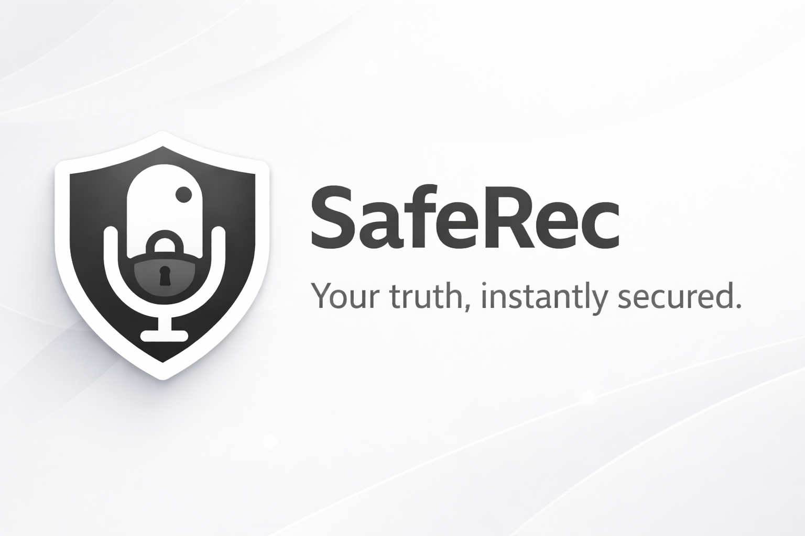

# SafeRec

<a href="https://play.google.com/store/apps/details?id=net.ark3us.saferec">
  
</a>


**SafeRec** is an open-source Android application designed for emergency and high-risk situations. It ensures your critical evidence is safe by recording (video and audio) and instantly uploading the footage in chunks directly to your Google Drive. Even if your phone is destroyed, broken, or confiscated during an event, your recordings are already securely preserved in your cloud storage. 

Furthermore, SafeRec generates verifiable timestamp certificates (TSA) to prove the authenticity and integrity of your recordings, making them robust for evidentiary purposes.

## Motivations

In emergency situations, every second is vital. A traditional camera app saves the video locally only *after* the recording is stopped. If the device is taken, broken, or turned off during the event, the evidence is often lost forever or corrupted. 

SafeRec solves this fundamental flaw by continuously uploading video and audio chunks to your Google Drive in real-time. This guarantees that whatever was recorded up until the moment of device failure or confiscation is securely preserved. The cryptographic TSA stamping adds an irrefutable layer of provability for legal or evidentiary use, ensuring the file existed at a specific point in time and has not been tampered with.

## Key Features

- **Instant Cloud Backup**: Automatically uploads video/audio chunks directly to Google Drive as they are being recorded.
- **Background Recording**: Uses an Android Foreground Service, allowing you to seamlessly record even when the screen is locked or while you are using other apps.
- **Audio-Only Mode**: Easily toggle between Video+Audio and Audio-Only modes for discretion, battery-saving, and reduced bandwidth.
- **Quick Settings Tile**: Start and stop recordings instantly via the Android Quick Settings drop-down menu, without ever needing to open the app.
- **Auto-Start**: Configure the app to automatically begin recording the moment the app is launched or the Tile is tapped.
- **Cryptographic Timestamping (TSA)**: Hashes the media files (SHA-256) and requests timestamp certificates from a recognizable Time Stamping Authority (Sectigo), proving the integrity and creation time of your recordings.
- **Chunk Management**: Automatically chunks video files (with adjustable chunk sizes) to ensure frequent and manageable uploads, minimizing the risk of losing long segments.
- **Video Quality Controls**: Adjust video quality (High 720p, Medium 480p, Low 360p) to balance file size against upload speeds.

## Technical Details

- **Language & Architecture**: Built entirely in Java using native Android APIs.
- **Camera API**: Utilizes the modern `Camera2` API for robust video capture seamlessly routed to a `MediaMuxer`.
- **Cloud Integration**: Powered by the Google Drive API v3 and Google Play Services Auth for secure, token-based uploads.
- **Minimum SDK**: Android 8.0 (API Level 26).
- **Target SDK**: Android 16 (API Level 36).

## Build and Run Instructions

### Prerequisites
- [Android Studio](https://developer.android.com/studio) (latest stable version recommended).
- JDK 11 (specified in `build.gradle.kts`).
- An Android Device or Emulator running Android 8.0 (API level 26) or higher.
- A Google Cloud Console Project with the **Google Drive API** enabled.

### Setup & Compilation
1. **Clone the repository**:
   ```bash
   git clone https://github.com/yourusername/SafeRec.git
   cd SafeRec
   ```
2. **Open in Android Studio**:
   Import the project into Android Studio and let Gradle sync the dependencies.

3. **Configure Google API Credentials**:
   Wait, before you start, ensure you have a Google account. The app requires a specific OAuth 2.0 Client ID to interact with Google Drive.

   #### A. Create the Project
   - Go to the [Google Cloud Console](https://console.cloud.google.com/).
   - Create a new project named **SafeRec** (or any name you prefer).
   - Go to **APIs & Services > Library** and search for **Google Drive API**. Click **Enable**.

   #### B. Configure OAuth Consent Screen
   - Go to **APIs & Services > OAuth consent screen**.
   - Choose **External** (unless you have a Google Workspace org).
   - Fill in the required fields (App name, User support email, Developer contact info).
   - Under **Scopes**, add `.../auth/drive.file` (this allows SafeRec to only access files it creates).

   #### C. Create Android Credentials
   - Go to **APIs & Services > Credentials**.
   - Click **Create Credentials > OAuth client ID**.
   - Select **Android** as the application type.
   - **Name**: SafeRec Android Client
   - **Package name**: `net.ark3us.saferec`
   - **SHA-1 certificate fingerprint**: You need your debug/release fingerprint.

   #### D. Get your SHA-1 Fingerprint
   You can get this by running the following command in your terminal:
   ```bash
   # On Linux/macOS
   keytool -list -v -keystore ~/.android/debug.keystore -alias androiddebugkey -storepass android -keypass android
   
   # On Windows
   keytool -list -v -keystore "%USERPROFILE%\.android\debug.keystore" -alias androiddebugkey -storepass android -keypass android
   ```
   Look for the `SHA1` line in the output and paste it into the Google Cloud Console.

   *Note: If you are using a release keystore, replace the path above with your `.jks` file path.*

4. **Build the Project**:
   You can build the APK directly through Android Studio ("Build > Build Bundle(s) / APK(s) > Build APK(s)") or via the command line:
   ```bash
   ./gradlew assembleDebug
   ```

5. **Run the App**:
   Deploy the application to your emulator or physical Android device. Make sure to grant the necessary permissions (Camera, Microphone, Foreground Service, Notifications) upon the first launch, and authenticate with your Google account when prompted to authorize Google Drive access.

## Credits

This application was developed with the assistance of **Antigravity**.

## License

This project is licensed under the MIT License - see the [LICENSE](LICENSE) file for details.
